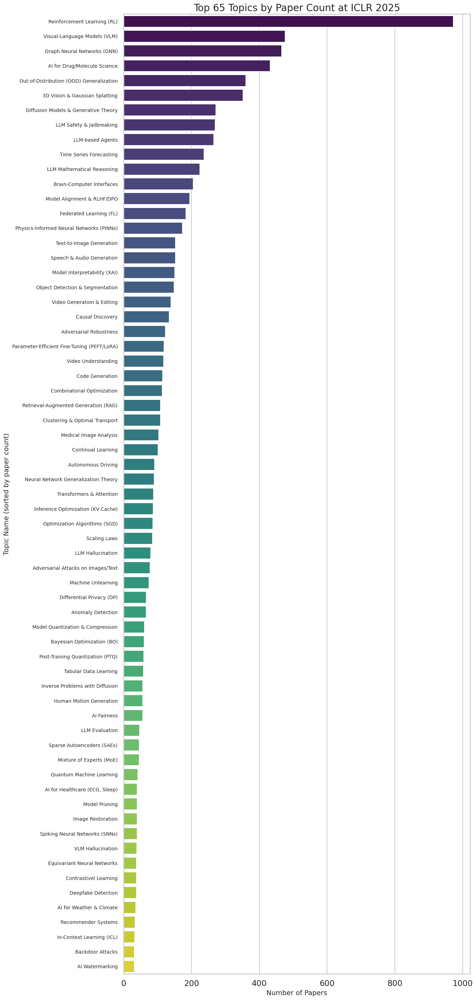
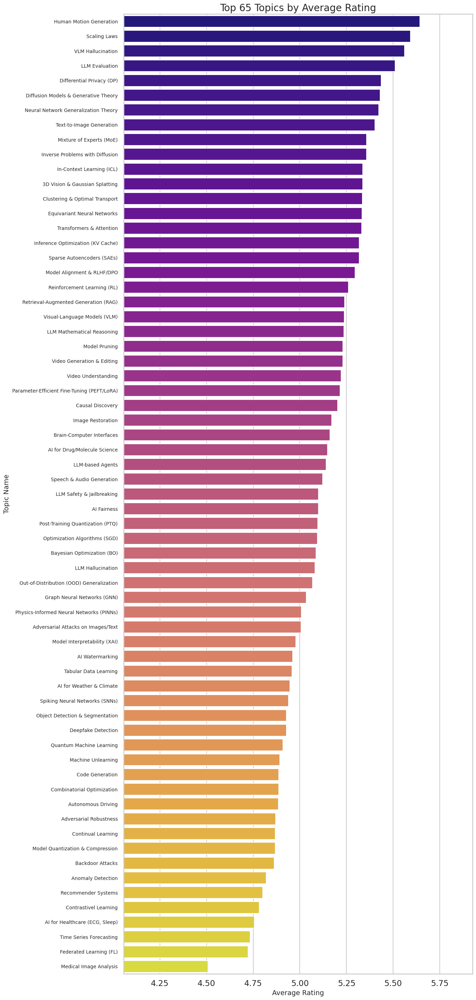
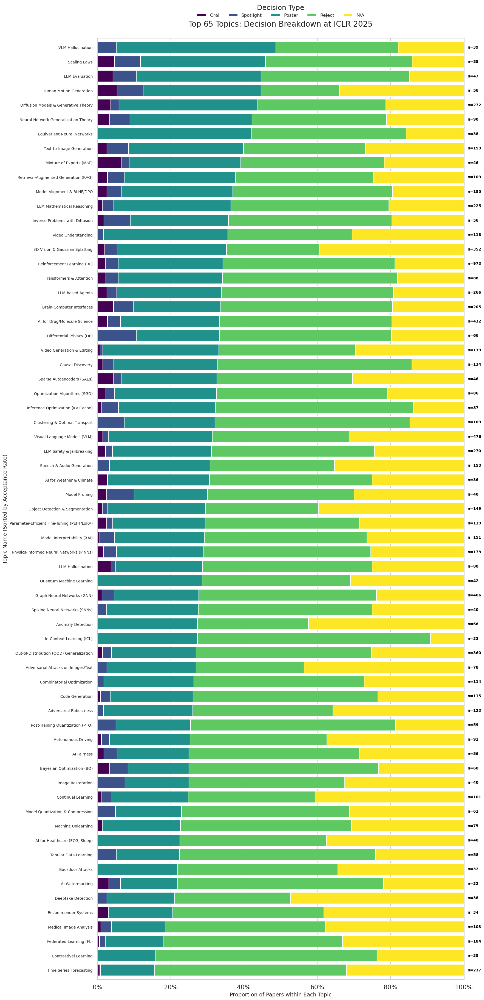
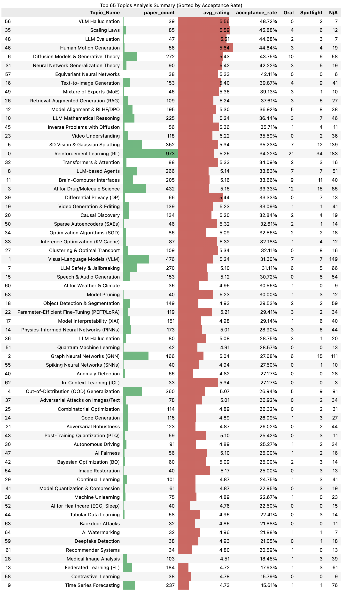

<div align="right"><strong>English</strong> | <a href="README_cn.md">中文</a></div>

# AI Academic Conference Hotspot Analysis Framework

[](https://www.python.org/downloads/) [](LICENSE)

This framework provides an automated and configurable pipeline for mining research hotspots from papers submitted to top AI conferences (e.g., ICLR, NeurIPS, ICML). Driven by configuration files, it can execute data fetching, topic modeling, and results visualization.

## 📋 Table of Contents

- [📊 Analysis Showcase (ICLR 2025 Example)](#-analysis-showcase-iclr-2025-example)
- [📂 Project Structure](#-project-structure)
- [🚀 Quick Start](#-quick-start)
  - [1. Environment Setup](#1-environment-setup)
  - [2. Configure Analysis Task](#2-configure-analysis-task)
  - [3. Run Automated Pipeline](#3-run-automated-pipeline)
- [🔬 Exploratory Analysis (Jupyter Notebooks)](#-exploratory-analysis-jupyter-notebooks)
- [💡 Advanced Options](#-advanced-options)
- [🤝 Contributing](#-contributing)
- [📄 License](#-license)

## 📊 Analysis Showcase (ICLR 2025 Example)

Below are example results generated by analyzing ICLR 2025 conference papers using this framework.

#### **Topic Hotness Ranking (by Paper Count)**


#### **Topic Quality Assessment (by Average Reviewer Score)**


#### **Topic Acceptance Composition (Sorted by Acceptance Rate)**


#### **Comprehensive Statistics Table**


> **Note**: Running `main.py` will generate the latest analysis results based on your configuration.

## 📂 Project Structure

```text
.
├── configs/              # YAML configuration files for analysis tasks
├── data/                 # (Git ignored) Stores raw (.jsonl) and processed (.csv) data
├── docs/                 # Documentation and related resources (e.g., README images)
├── LICENSE               # Project license file
├── main.py               # Main entry point script (runs the analysis)
├── models/               # (Git ignored) Stores downloaded machine learning models
├── notebooks/            # Jupyter Notebooks (tutorials, exploratory analysis)
├── README_cn.md          # Project description in Chinese
├── README.md             # Project description in English (this file)
├── requirements.txt      # Python dependency list
├── results/              # (Git ignored) Stores analysis results (plots, tables, models)
├── src/                  # Core Python functional modules
│   ├── analyze.py        # Analysis and visualization logic
│   ├── get_papers.py     # Data fetching logic
│   ├── run_topic_modeling.py # Topic modeling logic
│   └── utils.py          # (Optional) Common utility functions
└── .gitignore            # Specifies intentionally untracked files that Git should ignore
````

## 🚀 Quick Start

### 1\. Environment Setup

It is recommended to use Conda for environment creation and `pip` for installing dependencies.

```bash
# Clone the repository
git clone [https://github.com/HenryLi-CASIA/AI-Paper-Trends.git](https://github.com/HenryLi-CASIA/AI-Paper-Trends.git)
cd AI-Paper-Trends

# 1. Create a new Conda environment (Python 3.10 recommended)
conda create --name ai-trend-analysis python=3.10

# 2. Activate the newly created environment
conda activate ai-trend-analysis

# 3. Install all required libraries using requirements.txt
pip install -r requirements.txt
```

### 2\. Configure Analysis Task

The analysis pipeline is defined by `.yaml` files in the `configs/` directory.

1.  Navigate to the `configs/` directory.
2.  Duplicate an existing `.yaml` file or create a new one.
3.  Modify the parameters within the file to specify your analysis target.

**Example (`configs/iclr_2025_analysis.yaml`):**

```yaml
conference_id: 'ICLR.cc/2025/Conference' # Target conference ID
fetch_reviews: True                      # Whether to fetch detailed review info
limit: null                              # Upper limit on papers to process (null=unlimited)

topic_modeling:
  enabled: True                          # Whether to perform topic modeling
  min_topic_size: 30                     # BERTopic minimum topic size

analysis:
  enabled: True                          # Whether to perform analysis and visualization
  tasks:                                 # List of analysis tasks to execute
    - 'plot_paper_count'                 #   - Plot ranking by paper count
    - 'plot_avg_rating'                  #   - Plot ranking by average score
    - 'plot_decision_breakdown'          #   - Plot decision composition breakdown
    - 'generate_summary_table'           #   - Generate statistics table

output_folder_name: 'iclr_2025_analysis' # Output directory name under results/
```

### 3\. Run Automated Pipeline

Execute `main.py` from the project root directory, specifying the configuration file.

```bash
python main.py --config configs/iclr_2025_analysis.yaml
```

The script will execute the data fetching, topic modeling, and results generation steps according to the configuration. Outputs will be located in the `data/` and `results/` directories.

## 🔬 Exploratory Analysis (Jupyter Notebooks)

The `notebooks/` directory provides a Jupyter environment for more in-depth or customized exploratory analysis based on the processed data (`data/processed/*.csv`) generated by `main.py`.

**Usage Flow**:

1.  Ensure the Conda environment is activated: `conda activate ai-trend-analysis`
2.  Start Jupyter Lab from the project root: `jupyter lab`
3.  Open the `.ipynb` files within the `notebooks/` directory in your browser.

## 💡 Advanced Options

### Analyzing Different Conferences

Modify the `conference_id` in the configuration file. Common ID examples:

  * **ICLR**: `ICLR.cc/2025/Conference`
  * **NeurIPS**: `NeurIPS.cc/2023/Conference`
  * **ICML**: `ICML.cc/2024/Conference`

> **Suggestion**: Verify the exact ID of the target conference on the [OpenReview](https://openreview.net/) website.

### Quick Testing

To quickly validate the pipeline or configuration, set the `limit` parameter in the config file to process only a subset of papers:

```yaml
limit: 100 # Process only the first 100 papers
```

## 🤝 Contributing

Contributions are welcome\! Please feel free to report issues, suggest features, or submit code contributions via [Issues](https://github.com/HenryLi-CASIA/AI-Paper-Trends/issues) or [Pull Requests](https://github.com/HenryLi-CASIA/AI-Paper-Trends/pulls).

## 📄 License

This project is released under the [MIT License](https://www.google.com/search?q=LICENSE).
