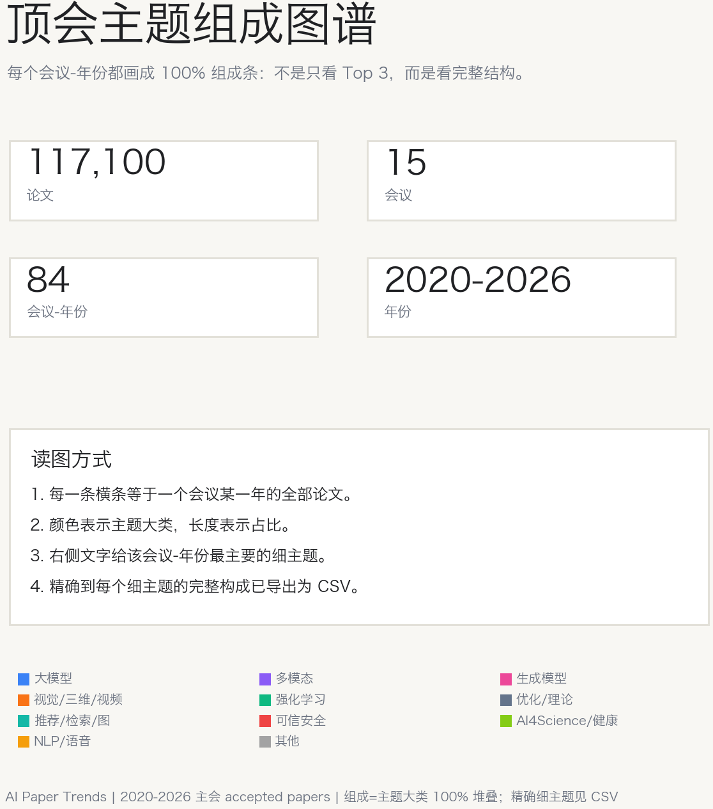

<div align="right"><strong>English</strong> | <a href="README_cn.md">中文</a></div>

# AI Paper Trends

Tools for crawling public AI conference paper metadata, normalizing main-conference accepted papers, clustering research topics, and tracking topic trends over time.

The project started as an ICLR 2025 OpenReview analysis pipeline. It has now been expanded into a multi-conference trend-analysis workflow that clusters papers independently for each venue-year, so topic distributions are comparable across conferences and years.

This is not just a paper list. The goal is to provide a reproducible **topic composition atlas** for major AI conferences: what each venue-year is made of, and how those research themes evolve over time.

## Current Analysis

The latest committed run is an accepted-paper analysis for major AI venues from 2020 to 2026.

| Metric | Value |
|---|---:|
| Venues | 15 |
| Venue-year groups | 84 |
| Papers used for clustering | 117,100 |
| Venue-year topics | 763 |
| Broad topic families in the atlas | 15 |
| Final outlier papers | 0 |
| Years covered | 2020-2026 |
| 2026 accepted-paper data currently included | ICLR, AAAI |

Method:

`BGE embeddings -> cosine kNN graph -> Louvain community detection -> small-community merge -> deterministic Chinese topic naming`

Scope:

- Accepted main-conference papers only.
- NLP venues exclude Findings, Industry, SRW, and other non-main tracks.
- 2026 currently includes legally confirmed `ICLR 2026 accepted` and `AAAI 2026 Technical Tracks accepted`.
- Large raw crawls, per-paper topic assignments, embedding files, and model caches are intentionally not committed.

Committed result tables:

| File | Rows | What it contains |
|---|---:|---|
| [REPORT_CN.md](docs/results/venue_year_main_accepted_topics_2020_2026_louvain_bge_m25/REPORT_CN.md) | - | Full Chinese narrative report |
| [run_summary_by_venue_year.csv](docs/results/venue_year_main_accepted_topics_2020_2026_louvain_bge_m25/run_summary_by_venue_year.csv) | 84 | Per venue-year paper counts, graph sizes, topic counts, outlier rates |
| [top10_topics_by_venue_year.csv](docs/results/venue_year_main_accepted_topics_2020_2026_louvain_bge_m25/top10_topics_by_venue_year.csv) | 700 | Top 10 topics for every available venue-year |
| [topic_summary_by_venue_year.csv](docs/results/venue_year_main_accepted_topics_2020_2026_louvain_bge_m25/topic_summary_by_venue_year.csv) | 763 | Full topic summary with labels, keywords, counts, shares, representative titles |
| [label_trend_by_venue_year.csv](docs/results/venue_year_main_accepted_topics_2020_2026_louvain_bge_m25/label_trend_by_venue_year.csv) | 763 | Topic-label trend table across years and venues |
| [venue_year_family_composition.csv](docs/visuals/xhs_composition_atlas_2020_2026/venue_year_family_composition.csv) | 473 | Broad family composition for every venue-year |
| [venue_year_topic_composition_full.csv](docs/visuals/xhs_composition_atlas_2020_2026/venue_year_topic_composition_full.csv) | 763 | Complete fine-grained topic composition for every venue-year |

## Topic Composition Atlas

The repository includes lightweight composition visuals for reading and sharing:



- Atlas cover: [docs/visuals/xhs_composition_atlas_2020_2026/00_composition_atlas_cover.png](docs/visuals/xhs_composition_atlas_2020_2026/00_composition_atlas_cover.png)
- Year-by-year venue composition: [docs/visuals/xhs_composition_atlas_2020_2026/by_year/](docs/visuals/xhs_composition_atlas_2020_2026/by_year/)
- Venue-by-venue yearly composition: [docs/visuals/xhs_composition_atlas_2020_2026/by_venue/](docs/visuals/xhs_composition_atlas_2020_2026/by_venue/)

Each horizontal composition bar represents all accepted papers from one venue-year. Colors encode broad topic families and segment lengths encode shares. The right-side labels show the leading fine-grained topics; the full fine-grained composition is available in CSV.

## Coverage by Year

| Year | Venue-Year Groups | Papers | Topics |
|---:|---:|---:|---:|
| 2020 | 13 | 11,555 | 106 |
| 2021 | 14 | 13,334 | 117 |
| 2022 | 14 | 14,333 | 117 |
| 2023 | 13 | 17,424 | 120 |
| 2024 | 14 | 22,334 | 132 |
| 2025 | 14 | 28,619 | 144 |
| 2026 | 2 | 9,501 | 27 |

## Coverage by Area

| Area | Venues | Venue-Year Groups | Papers | Topics |
|---|---|---:|---:|---:|
| Computer Vision | CVPR, ICCV, ECCV | 12 | 24,999 | 132 |
| Machine Learning | ICLR, ICML, NeurIPS | 19 | 46,238 | 214 |
| NLP | ACL, EMNLP, NAACL | 16 | 14,651 | 147 |
| General AI | AAAI, IJCAI | 13 | 21,179 | 121 |
| Multimedia | ACMMM | 6 | 5,006 | 57 |
| Data Mining / IR / Web | KDD, SIGIR, WWW | 18 | 5,027 | 92 |

## Coverage by Venue

| Area | Venue | Years | Venue-Year Groups | Papers | Topics | Latest #1 topic |
|---|---|---:|---:|---:|---:|---|
| General AI | AAAI | 2020-2026 | 7 | 15,638 | 73 | 2026: 3D vision, Gaussian Splatting, novel-view synthesis, reconstruction (610, 14.70%) |
| General AI | IJCAI | 2020-2025 | 6 | 5,541 | 48 | 2025: multimodal understanding, vision-language representation, cross-modal alignment (277, 21.64%) |
| Machine Learning | ICLR | 2020-2026 | 7 | 15,529 | 71 | 2026: video diffusion generation and editing (752, 14.05%) |
| Machine Learning | ICML | 2020-2025 | 6 | 11,268 | 64 | 2025: efficient LLM inference, compression, resource optimization (446, 13.39%) |
| Machine Learning | NeurIPS | 2020-2025 | 6 | 19,441 | 79 | 2025: RL-driven LLM reasoning and reward learning (781, 14.77%) |
| Computer Vision | CVPR | 2020-2025 | 6 | 13,140 | 68 | 2025: text-to-image diffusion, sampling, image editing (458, 15.95%) |
| Computer Vision | ICCV | 2021-2025 | 3 | 6,469 | 36 | 2025: multimodal/VLM understanding and cross-modal reasoning (460, 17.03%) |
| Computer Vision | ECCV | 2020-2024 | 3 | 5,390 | 28 | 2024: open-vocabulary detection, segmentation, CLIP semantics (373, 15.63%) |
| NLP | ACL | 2020-2025 | 6 | 5,902 | 60 | 2025: efficient LLMs, long context, attention, inference optimization (308, 18.13%) |
| NLP | EMNLP | 2020-2025 | 6 | 6,550 | 56 | 2025: retrieval-augmented LLMs, RAG, knowledge injection, QA (254, 14.04%) |
| NLP | NAACL | 2021-2025 | 4 | 2,199 | 31 | 2025: LLM social safety, bias, misinformation, detection (126, 17.55%) |
| Multimedia | ACMMM | 2020-2025 | 6 | 5,006 | 57 | 2025: multimedia retrieval, cross-modal retrieval, semantic matching (197, 15.77%) |
| Data Mining | KDD | 2020-2025 | 6 | 1,985 | 36 | 2025: graph foundation models, LLM-enhanced graph learning, node representation (122, 22.10%) |
| Information Retrieval | SIGIR | 2020-2025 | 6 | 1,077 | 23 | 2025: recommendation, preference modeling, feedback learning, personalized ranking (85, 35.56%) |
| Web / Recommender Systems | WWW | 2020-2025 | 6 | 1,965 | 33 | 2025: retrieval-augmented recommendation, ranking, personalization (40, 25.97%) |

## Recent Topic Examples

### ICLR 2026

| Rank | Topic | Papers | Share |
|---:|---|---:|---:|
| 1 | Video diffusion generation and editing | 752 | 14.05% |
| 2 | Efficient LLM inference, compression, and resource optimization | 691 | 12.91% |
| 3 | RL-driven LLM reasoning and reward learning | 655 | 12.24% |
| 4 | Stochastic/non-convex optimization and convergence | 645 | 12.05% |
| 5 | Multimodal/VLM understanding and reasoning | 625 | 11.68% |

### AAAI 2026

| Rank | Topic | Papers | Share |
|---:|---|---:|---:|
| 1 | 3D vision: Gaussian Splatting and view synthesis | 610 | 14.70% |
| 2 | LLM reasoning: QA, commonsense, and chain-of-thought | 596 | 14.36% |
| 3 | Reinforcement learning: policy optimization and reward learning | 463 | 11.16% |
| 4 | Graph anomaly detection, clustering, and structural representation | 391 | 9.42% |
| 5 | Efficient LLM inference, compression, and resource optimization | 344 | 8.29% |

### NeurIPS 2025

| Rank | Topic | Papers | Share |
|---:|---|---:|---:|
| 1 | RL-driven LLM reasoning and reward learning | 781 | 14.77% |
| 2 | Video diffusion generation and editing | 583 | 11.03% |
| 3 | Multimodal/VLM understanding and reasoning | 575 | 10.88% |
| 4 | Bandits, regret bounds, and online decision making | 570 | 10.78% |
| 5 | Stochastic/non-convex optimization and convergence | 548 | 10.37% |

### CVPR 2025

| Rank | Topic | Papers | Share |
|---:|---|---:|---:|
| 1 | Text-to-image diffusion, sampling, and image editing | 458 | 15.95% |
| 2 | 3D vision: point clouds, depth estimation, and camera pose | 413 | 14.39% |
| 3 | Multimodal/VLM understanding and cross-modal reasoning | 349 | 12.16% |
| 4 | Video diffusion generation and editing | 276 | 9.61% |
| 5 | Embodied AI: robot manipulation, navigation, and VLA | 253 | 8.81% |

## Quick Start

```bash
git clone https://github.com/zhihengli-casia/AI-Paper-Trends.git
cd AI-Paper-Trends
conda create -n ai-paper-trends python=3.10
conda activate ai-paper-trends
pip install -r requirements.txt
```

### Legacy Single-Venue OpenReview Analysis

The original ICLR/OpenReview workflow is still available for analyzing submissions, reviews, decisions, and reviewer scores where OpenReview exposes them.

```bash
python main.py --config configs/iclr_2025_full_analysis.yaml
```

### Multi-Conference Accepted-Paper Trend Analysis

Run the large workflow in `tmux` or another long-running session.

```bash
# 1. Crawl public metadata.
python src/crawl_recent_conferences.py \
  --output-dir data/recent_conferences \
  --run-name recent_ai_conference_papers \
  --fetch-detail-abstracts

# 2. Build the strict main-conference accepted view.
python src/build_main_accepted_view.py \
  --input data/recent_conferences/recent_ai_conference_papers.jsonl \
  --output data/recent_conferences/main_accepted_ai_conference_papers.jsonl

# 3. Cluster each venue-year independently with kNN + Louvain.
python src/analyze_venue_year_louvain_topics.py \
  --input data/recent_conferences/main_accepted_ai_conference_papers.jsonl \
  --output-dir results/venue_year_main_accepted_topics_louvain \
  --model-name models/bge-base-en-v1.5 \
  --device mps
```

If only naming rules or aggregate tables changed, rebuild outputs without rerunning embeddings/clustering:

```bash
python src/rebuild_venue_year_outputs.py \
  --results-dir results/venue_year_main_accepted_topics_louvain \
  --top-k 10
```

Generate the composition atlas:

```bash
python src/create_xhs_composition_atlas.py \
  --results-dir docs/results/venue_year_main_accepted_topics_2020_2026_louvain_bge_m25 \
  --output-dir docs/visuals/xhs_composition_atlas_2020_2026
```

## Project Structure

```text
.
├── configs/                     # Legacy single-venue OpenReview configs
├── data/                        # Local crawls and intermediate files; gitignored
├── docs/results/                # Lightweight committed analysis artifacts
├── docs/visuals/                # Topic-composition atlas visuals
├── main.py                      # Legacy OpenReview entry point
├── notebooks/                   # Notebook examples
├── src/
│   ├── crawl_recent_conferences.py
│   ├── crawl_2020_2025_backfill.py
│   ├── build_main_accepted_view.py
│   ├── analyze_venue_year_louvain_topics.py
│   ├── create_xhs_composition_atlas.py
│   ├── refine_topic_names.py
│   ├── rebuild_venue_year_outputs.py
│   └── ...
└── requirements.txt
```

## Notes

- The multi-conference trend analysis uses public paper metadata only.
- Review scores and rejected submissions are not uniformly public across venues.
- OpenReview-based single-conference analysis can include submissions/rejections/reviews when available, but those fields should not be mixed directly with accepted-only proceedings data from other venues.

## License

MIT License.
